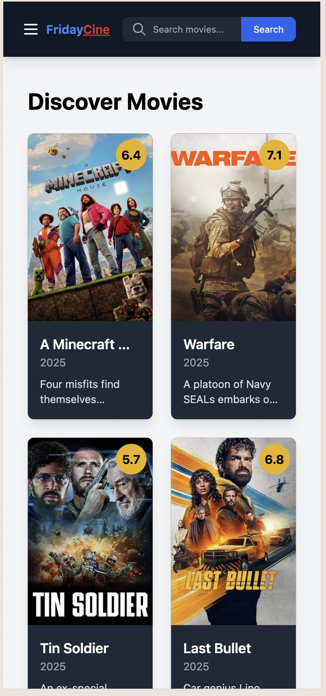
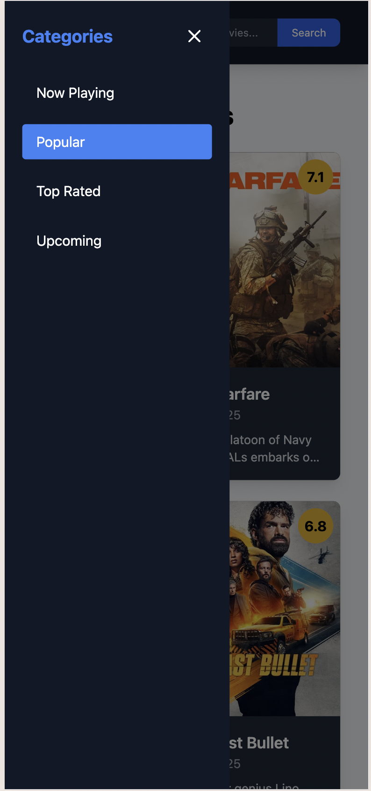
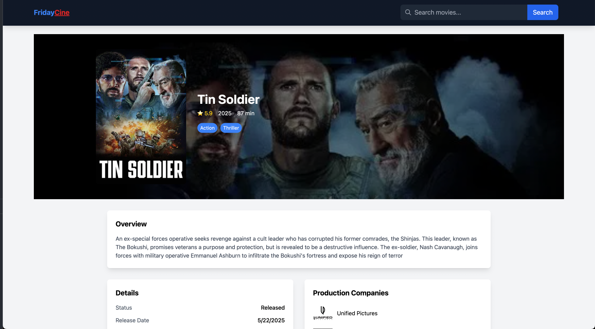
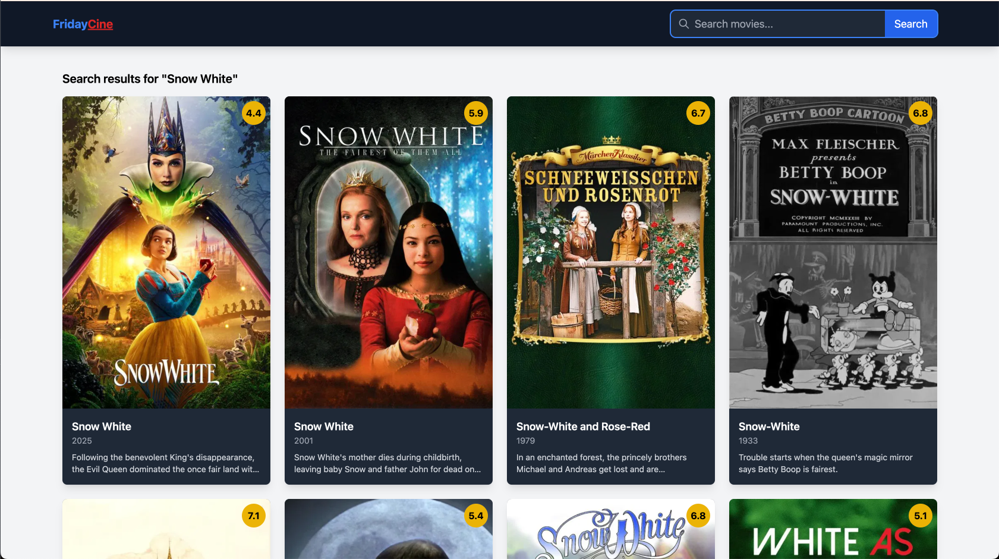

# Friday Cinemas


## 💻 Tech Stack:


[](#)
[](#)
[](#)


---

## API Source:

https://www.themoviedb.org/

## Preview

- Home (Web)


- Home (Mobile)



- SideBar (Mobile)



- Hovering Movie Card


- Movie Detail Page



- Search Page



- Pagination Button


## Unit Test


## Installation:

This guide explains how to install Vitest using PNPM and how to run tests in your project.

---

## Prerequisites

- Node.js version >= 18.0.0
- Vite version >= 5.0.0
- PNPM installed globally (if not, install it via `npm install -g pnpm`)

---

1. Clonning This Project

```
git clone https://github.com/septalonika/Friday-Cinemas.git
```

Once it's clonned, you will need to move to the folder repository on your local device

```
cd Friday-Cinemas
```

2. Install Dependendecies

```
pnpm install
```

3. Once you're done with the development, you will need to add your progress and commit it based on the changes you've made

```
git add (changed file) // sample file index.html

git commit -m "update message" // sample commit "Adding Header"

git push origin dev

```

4. Merge it into main branch for the production build

```
git fetch
git checkout main
git pull origin main
git pull origin dev --no-rebase // if you're facing any conflicts, you will need to resolve it manually
git commit -m "Merge dev into main"
git push origin main
```

# React + TypeScript + Vite

This template provides a minimal setup to get React working in Vite with HMR and some ESLint rules.

Currently, two official plugins are available:

- [@vitejs/plugin-react](https://github.com/vitejs/vite-plugin-react/blob/main/packages/plugin-react) uses [Babel](https://babeljs.io/) for Fast Refresh
- [@vitejs/plugin-react-swc](https://github.com/vitejs/vite-plugin-react/blob/main/packages/plugin-react-swc) uses [SWC](https://swc.rs/) for Fast Refresh
