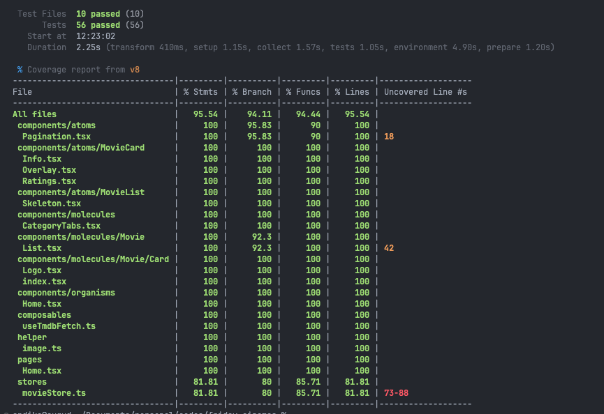

# Friday Cinemas


### Link to demo:

https://fridaycine.cugud.com/

## 💻 Tech Stack:


[](#)
[](#)
[](#)


---

## API Source:

https://www.themoviedb.org/

## Structure Folder

```
└── 📁src
    └── 📁assets
        └── react.svg
    └── 📁components
        └── .DS_Store
        └── 📁atoms
            └── 📁Header
                └── HamburgerToggle.tsx
                └── Logo.tsx
                └── SearchBar.tsx
                └── SideBar.tsx
            └── 📁MovieCard
                └── Info.tsx
                └── Overlay.tsx
                └── Ratings.tsx
            └── 📁MovieDetail
                └── Error.tsx
                └── Genre.tsx
                └── Overview.tsx
                └── Sekeleton.tsx
            └── 📁MovieList
                └── Skeleton.tsx
            └── Pagination.tsx
            └── 📁Search
                └── Error.tsx
                └── Loading.tsx
                └── NoQuery.tsx
                └── NoResult.tsx
                └── Result.tsx
        └── 📁molecules
            └── CategoryTabs.tsx
            └── Footer.tsx
            └── Header.tsx
            └── 📁Movie
                └── 📁Card
                    └── index.tsx
                    └── Logo.tsx
                └── 📁Detail
                    └── Banner.tsx
                    └── 📁Information
                        └── Bio.tsx
                        └── Companies.tsx
                        └── Information.tsx
                └── List.tsx
        └── 📁organisms
            └── Home.tsx
            └── MovieDetails.tsx
            └── Search.tsx
    └── 📁composables
        └── useTmdbFetch.ts
    └── 📁helper
        └── image.ts
    └── 📁pages
        └── Home.tsx
        └── MovieDetail.tsx
        └── Search.tsx
    └── 📁stores
        └── movieStore.ts
    └── 📁test
        └──  MovieList.test.tsx
        └── CategoryTab.test.tsx
        └── Fetching.test.ts
        └── HelperImage.test.ts
        └── HomeComponent.test.tsx
        └── HomePage.test.tsx
        └── MovieCard.test.tsx
        └── MovieCardLogo.test.tsx
        └── MovieStore.test.ts
        └── Pagination.test.tsx
    └── 📁types
        └── movies.ts
    └── .DS_Store
    └── App.css
    └── App.tsx
    └── index.css
    └── Link.js
    └── main.tsx
    └── sum.js
    └── vite-env.d.ts
```

## Preview

- Home (Web)


- Home (Mobile)


- SideBar (Mobile)


- Hovering Movie Card


- Movie Detail Page


- Search Page


- Pagination Button


## Unit Test



## Installation:

This guide explains how to install Vitest using PNPM and how to run tests in your project.

---

## Prerequisites

- Node.js version >= 18.0.0
- Vite version >= 5.0.0
- PNPM installed globally (if not, install it via `npm install -g pnpm`)

---

1. Clonning This Project

```
git clone https://github.com/septalonika/Friday-Cinemas.git
```

Once it's clonned, you will need to move to the folder repository on your local device

```
cd Friday-Cinemas
```

2. Install Dependendecies

```
pnpm install
```

3. Once you're done with the development, you will need to add your progress and commit it based on the changes you've made

```
git add (changed file) // sample file index.html

git commit -m "update message" // sample commit "Adding Header"

git push origin dev

```

4. Merge it into main branch for the production build

```
git fetch
git checkout main
git pull origin main
git pull origin dev --no-rebase // if you're facing any conflicts, you will need to resolve it manually
git commit -m "Merge dev into main"
git push origin main
```

# React + TypeScript + Vite

This template provides a minimal setup to get React working in Vite with HMR and some ESLint rules.

Currently, two official plugins are available:

- [@vitejs/plugin-react](https://github.com/vitejs/vite-plugin-react/blob/main/packages/plugin-react) uses [Babel](https://babeljs.io/) for Fast Refresh
- [@vitejs/plugin-react-swc](https://github.com/vitejs/vite-plugin-react/blob/main/packages/plugin-react-swc) uses [SWC](https://swc.rs/) for Fast Refresh
